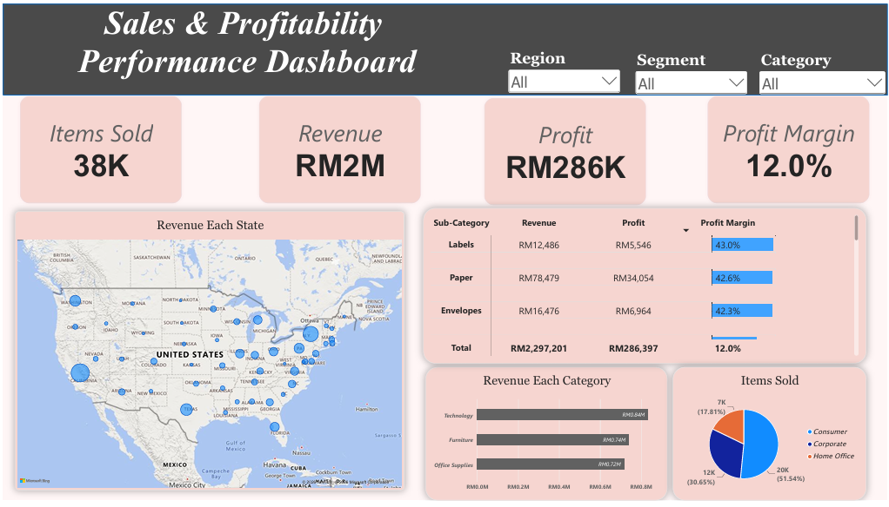

# 📊 Sales & Profitability Performance Analytics

## 🎯 Business Problem
Management lacked real-time visibility into regional sales performance, product profitability, and customer purchasing trends. Relying on static spreadsheets led to delayed decision-making and an inability to quickly identify underperforming product categories.

## 💡 Solution & Objectives
Developed an interactive Business Intelligence dashboard using Power BI to:
* Analyze over 9,900 transaction records to identify historical revenue and profitability trends.
* Segment performance by geographic region, product category, and customer type.
* Automatically flag high-revenue, negative-margin product sub-categories (e.g., Bookcases and Machines).

## 🛠️ Tools & Technologies
* **Data Processing & Visualization:** Power BI, DAX (Data Analysis Expressions)
* **Data Querying:** SQL
* **Version Control:** Git / GitHub

## 📈 Interactive Dashboard
*(The dashboard features dynamic slicing by Region, Segment, and Category to allow granular drill-downs into profit margins.)*

## 🧠 Key Business Insights
1. **The Margin Trap:** While `Tables` and `Bookcases` generate substantial revenue, they operate at a severe loss (negative profit margins). Management should investigate supply chain costs or pricing strategies for these specific sub-categories.
2. **Geographic Concentration:** A significant portion of total revenue (RM2M) is highly concentrated in specific coastal states (California, New York), suggesting an opportunity for targeted marketing campaigns in underperforming central regions.
3. **Consumer Dominance:** The `Consumer` segment drives the vast majority of items sold (51.5%), outpacing the Corporate and Home Office segments combined.

## 📂 Repository Structure
* `/sql` - SQL scripts demonstrating data aggregation and exploratory analysis (EDA) used to validate dashboard numbers.
* `/dashboards` - Dashboard screenshots and layout files.
* '/.csv' - Dataset used.
* '/.pbix' - Dashboard in Power BI file format.
